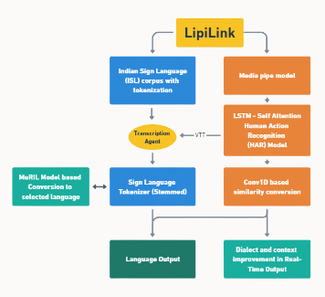

# LipiLink
# LipiLink: Translating Silence, Connecting Worlds

Deaf and hard-of-hearing individuals often face significant challenges in communicating effectively during phone and video conversations. Traditional communication methods can be limiting, leading to barriers in accessibility and interaction. Additionally, real-time translation and transcription in multiple languages are often unavailable, making it difficult for these individuals to engage in seamless cross-language communication.

LipiLink is an AI-powered app designed to enhance communication for deaf and hard-of-hearing individuals by transcribing real-time phone conversations in multiple Indian languages. It provides instant speech-to-text features, focusing on accessibility and privacy. Additionally, LipiLink includes real-time Indian Sign Language (ISL) translation during video calls, ensuring smooth and effective cross-language communication.

## Features

-**Real-time ISL Translation:** Enables instant ISL translation during video calls for smooth cross-language communication.

-**Voice-to-Text:** Converts spoken language into text in Indian languages, aiding users with speech impairments.

-**Multi-Language Support:** Dffers easy toggling between multiple Indian languages and dialects for diverse linguistic needs.

-**Browser Extension and App:** An extension and app enabling real-time sign language interpretation for the deaf on any video meeting platform.

## How it works

  

